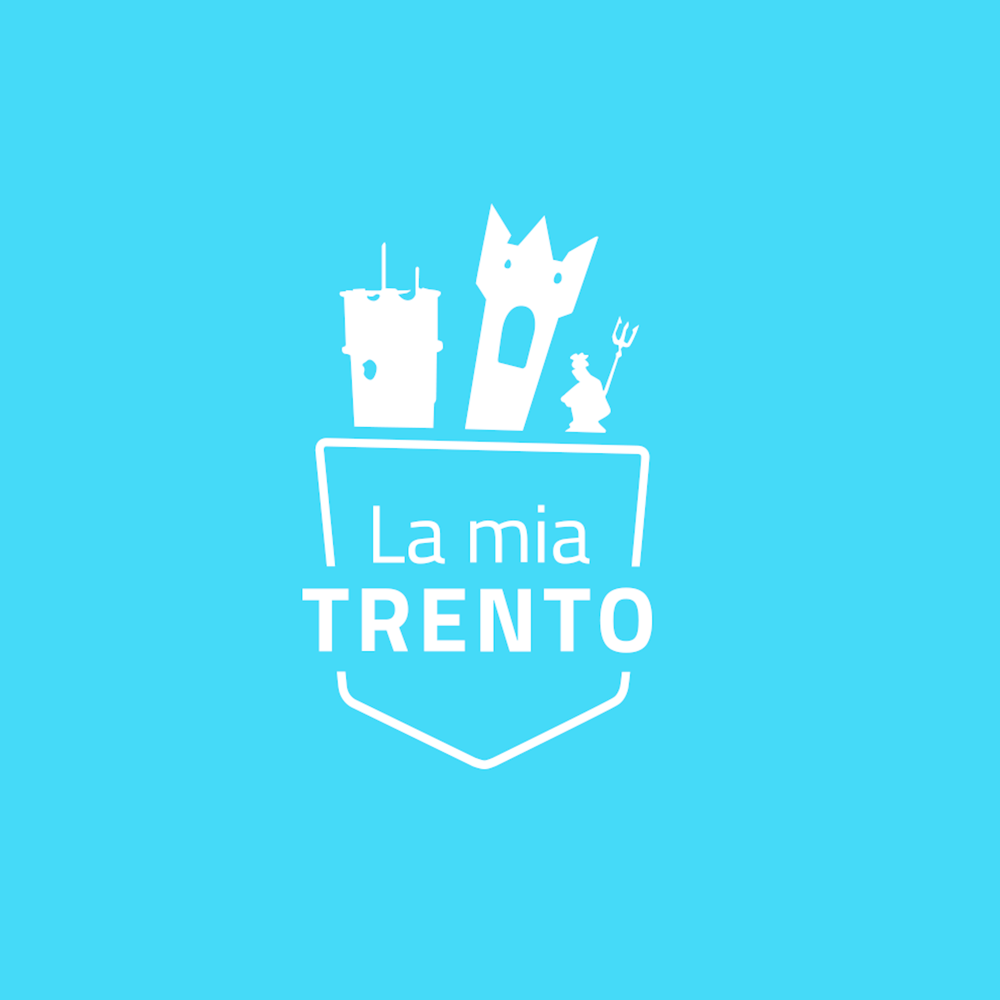

<a name="readme-top"></a>
<br />

<div align="center">
  <a href="https://github.dev/smartcommunitylab/modular-app/tree/2023-new-version">
    
  </a>

<h3 align="center">Modular App</h3>

<p align="center">
    This modular app aims to bring together different applications developed for the municipality of Trento within a single app. Each module can be developed independently and easily integrated within the container
    <br />
</div>

<!-- TABLE OF CONTENTS -->

<details>
  <summary>Table of Contents</summary>
  <ol>
    <li>
      <a href="#about-the-project">About The Project</a>
      <ul>
        <li><a href="#built-with">Built With</a></li>
      </ul>
    </li>
    <li>
      <a href="#getting-started">Getting Started</a>
      <ul>
        <li><a href="#prerequisites">Prerequisites</a></li>
        <li><a href="#installation">Installation</a></li>
      </ul>
    </li>
    <li><a href="#implementation">Implementation</a></li>
    <li><a href="#license">License</a></li>
    <li><a href="#contact">Contact</a></li>
    <li><a href="#acknowledgments">Acknowledgments</a></li>
  </ol>
</details>

<!-- ABOUT THE PROJECT -->

## About The Project

This project was born from the need of the municipality of Trento to collect all citizens' services in a single application accessible by the user

<p align="right">(<a href="#readme-top">back to top</a>)</p>

### Built With

* [![Angular][Angular.io]][Angular-url]
* [![Ionic][Ionic.com]][Ionic-url]
* [![Stencil][Stencil.com]][Stencil-url]

<p align="right">(<a href="#readme-top">back to top</a>)</p>

<!-- GETTING STARTED -->

## Getting Started

Once the project has been downloaded, several folders will be present within the main folder:
la-mia-trento: the main application that acts as a container for the individual modules
others: each of them represents an independent module that can be integrated with the main application. (my-trento-info, my-trento-transport, etc.)
It is possible to work on the individual modules separately by entering the specific folder.

### Prerequisites

To develop and edit using the same tools used for development you will need
Angular CLI: 16.2.2
Node: 16.14.0
Package Manager: npm 8.3.1
OS: darwin x64

Angular: 16.2.5
... animations, common, compiler, compiler-cli, core, forms
... language-service, platform-browser, platform-browser-dynamic
... router

Package                         Version
---------------------------------------

@angular-devkit/architect       0.1602.2
@angular-devkit/build-angular   16.2.2
@angular-devkit/core            16.2.2
@angular-devkit/schematics      16.2.2
@angular/cdk                    16.2.4
@angular/cli                    16.2.2
@schematics/angular             16.2.2
rxjs                            7.8.1
typescript                      5.0.4
zone.js                         0.13.3

For install the package you can use a tool like npm using the following syntax

```sh
npm install npm@8.3.1 -g
```

Instruction for setup Angular are provided [here](https://angular.io/guide/setup-local)

Others tools and framework used are the following

* ionic >=7.1.1

  ```sh
  npm install ionic@latest -g
  ```

  Instruction for setup ionic are provided [here](https://ionicframework.com/docs/intro/cli)
* stencil

  ```sh
  npm install stencil@latest -g
  ```

  Instruction for setup stencil are provided [here](https://stenciljs.com/docs/getting-started)

### Installation

1. Clone the repo
   ```sh
   git clone https://github.dev/smartcommunitylab/modular-app/tree/2023-new-version
   ```
2. Enter in the application folder
   ```sh
    cd la-mia-trento
   ```
3. Install NPM packages
   ```sh
   npm i
   ```

<p align="right">(<a href="#readme-top">back to top</a>)</p>

<!-- IMPLEMENTING YOUR OWN MODULE -->

## Implementation

The structure of the application, as described above, is composed of a container (folder: la-mia-trento) which provides some basic tools for the separate modules and a series of modules integrated with it.
The separate modules are composed of web components created using Stencil and contain:
src: the folder with the web components sources
utils: folder with various utility functions.
Inside the


<p align="right">(<a href="#readme-top">back to top</a>)</p>

<!-- LICENSE -->

## License

distributed under Apache [2.0](https://www.apache.org/licenses/LICENSE-2.0) license.

<p align="right">(<a href="#readme-top">back to top</a>)</p>

<!-- CONTACT -->

## Contact

Project Link: [https://github.com/github_username/repo_name](https://github.com/github_username/repo_name)
Comune di Trento app's page: [https://www.comune.trento.it/Aree-tematiche/Smart-city/App-e-Servizi-in-Comune/Tutte-le-APP-disponibili/APP-La-mia-Trento](https://www.comune.trento.it/Aree-tematiche/Smart-city/App-e-Servizi-in-Comune/Tutte-le-APP-disponibili/APP-La-mia-Trento)

<p align="right">(<a href="#readme-top">back to top</a>)</p>

<!-- ACKNOWLEDGMENTS -->

## Acknowledgments

* [FBK](https://www.fbk.eu/)
* [Comune di Trento](https://www.comune.trento.it/)

<p align="right">(<a href="#readme-top">back to top</a>)</p>

<!-- MARKDOWN LINKS & IMAGES -->
[Angular.io]: https://img.shields.io/badge/Angular-DD0031?style=for-the-badge&logo=angular&logoColor=white
[Angular-url]: https://angular.io/
[Ionic.com]: https://img.shields.io/badge/ionic-0769AD?style=for-the-badge&logo=ionic&logoColor=white
[Ionic-url]: https://ionic.com
[Stencil.com]: https://img.shields.io/badge/stencil-0769AD?style=for-the-badge&logo=stencil&logoColor=white
[stencil-url]: https://stencil.com